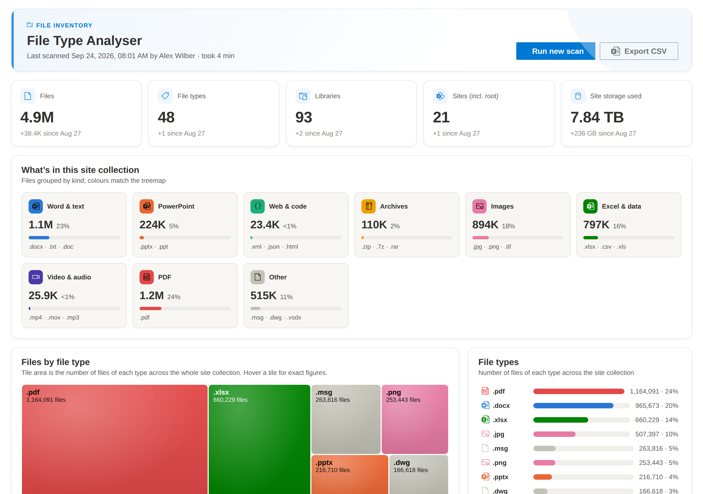

# File Type Analyser

**See what a SharePoint site collection is made of, by file type, in minutes.**
No Azure app registration, no file-by-file crawl, no extra licence. One
`.sppkg` and a site owner.


<sub>Sample data from a fictional site collection.</sub>

SharePoint Online tells you how much storage a site collection uses. It
does not tell you what that storage is made of. There is no built-in view
that breaks a site collection down by file type, so the usual options are a
PowerShell script or a third-party migration or governance tool. Both read
every file, which means the bigger the site, the longer you wait.

File Type Analyser asks SharePoint's search index instead. The index
already knows every file's type, so the web part gets a complete count for
each library with a single query, whether that library holds ten files or
ten million.

## Highlights

- **Fast at any size.** One search query per document library. Scan time
  depends on how many libraries you have, not how many files are in them,
  so a site collection with millions of documents and 10+ TB of storage
  typically scans in minutes.
- **Exact counts, not estimates.** Every figure is an aggregate from
  SharePoint's own search index: up to 500 distinct file types per
  library, with no sampling.
- **Nothing to set up outside SharePoint.** No Azure AD / Entra ID app, no
  client ID or secret, no Microsoft Graph permissions, no service account.
  The web part runs as the signed-in user through SPFx's built-in
  `SPHttpClient`.
- **Saved for everyone.** A site owner runs the scan once. The results are
  saved to the site's Site Assets library, and everyone who opens the page
  sees the latest dashboard straight away, with the change since the
  previous scan.
- **A dashboard people read.** Headline figures, category cards, a
  WinDirStat-style treemap of every file type, the full type list, a site
  and library tree, and CSV export for Excel.
- **Built for large tenants.** Requests are paced and retried on
  throttling (honouring `Retry-After`). A subsite you can't open is
  recorded and skipped instead of stopping the scan.
- **Fits the site it lives on.** It picks up the site's theme colours and
  respects reduced-motion settings.

## How it compares

|                                   | File-by-file inventory (script or tool) | File Type Analyser               |
| --------------------------------- | --------------------------------------- | -------------------------------- |
| Work per library                  | Reads every item                        | One search query                 |
| Scan time grows with              | Number of files                         | Number of libraries              |
| 5,000-item list view threshold    | Has to page around it                   | Not affected                     |
| App registration or extra licence | Usually required                        | None                             |
| Sharing the result                | Export a file and send it               | Saved on the page for everyone   |

## Get started

1. Download [`releases/file-type-analyser-webpart.sppkg`](releases/file-type-analyser-webpart.sppkg).
2. Upload it to your tenant or site collection App Catalog and click
   **Deploy**.
3. Add **File Type Analyser** to a page on the site collection you want to
   look at.
4. As a site owner or site collection admin, click **Start scan**.

Full deployment notes, including how to upgrade, are in [Deploy](#deploy).

**What the numbers cover.** Counts come from the search index, so they
include files that search has indexed and that the person running the scan
can see. Files in libraries excluded from search, or uploaded minutes before
the scan, are not counted until search picks them up.

## Why it scales

The obvious way to build this ("walk every folder, list every file") falls
over on a site collection with millions of documents — it means millions
of throttled REST calls. This solution avoids that entirely:

1. **Structure discovery is cheap.**
   `_api/web/getsubwebsfilteredforcurrentuser(...)` and `_api/web/lists`
   return metadata about subsites and document libraries only — never
   file listings. A site collection typically has dozens to low hundreds
   of libraries, not millions, so this step is fast regardless of how much
   content those libraries hold.
2. **File-type counts come from the search index, not file enumeration.**
   For each library, one call to `_api/search/query` with
   `querytext='IsDocument:1 Path:"<library URL>/*"'` and
   `refiners='FileType(filter=500/0/*)'` asks the already-built search index for an
   aggregated count per extension in that library. Whether the library
   holds 10 files or 10 million, this is a single request with a
   near-constant response size — the aggregation work happens server-side
   in the index, not in the browser.

   The trailing `/*` stops a library like `Documents` from also matching
   `Documents2`.

   **The search call must be made with OData 3.0.**
   `SPHttpClient.configurations.v1` sends an `OData-Version: 4.0` header,
   and the search REST endpoint only speaks OData 3.0 — it answers a v4
   request with HTTP 500 the moment it has real rows or refiners to
   serialize. An empty result set happens to serialize fine either way,
   which makes the failure look like a bad query (only libraries *with
   content* fail) when it is really a protocol-version mismatch. The
   service therefore calls search through
   `SPHttpClient.configurations.v1.overrideWith({ defaultODataVersion: ODataVersion.v3 })`;
   the `_api/web` and `_api/site` calls are fine on v4 and are left alone.
   Because OData 3 may wrap collections in a `{ results: [] }` envelope,
   the response parsing accepts both that and a bare array.

   **Up to 500 types per library.** Without options the `FileType`
   refiner returns only a library's 10 most common extensions, silently
   dropping rarer ones. `filter=500/0/*` (max bins / minimum frequency /
   name prefix) lifts that to 500. If a tenant rejects the option, the scan
   falls back to the plain refiner for the rest of that scan and the
   dashboard notes that some libraries only reported their top 10 types.
3. **Site storage is SharePoint's own figure.** The "Site storage used"
   headline comes from `_api/site?$select=Usage` — reported by SharePoint,
   not calculated. The web part does not attempt storage per file type:
   search only knows current file versions, while site storage is often
   dominated by version history (Excel autosave, for example), so any
   per-type storage figure built from search would be misleading.

## No Azure, no client id

Every call goes through SPFx's built-in `context.spHttpClient`, which
reuses the current signed-in user's SharePoint session (the SPFx host page
already establishes this — form digest + cookie auth). There is:

- no Azure AD app registration,
- no client id / client secret / certificate,
- no Microsoft Graph, and
- no `AadHttpClient`.

The web part only ever calls `_api/*` endpoints on the SharePoint site it
is added to, using whatever permissions the current user already has
there.

## Features

- **Saved results** — the last scan is saved to the site and shown to
  everyone who opens the page, so nobody lands on an empty web part (see
  *Saved results* below).
- **Look and feel** — a light header tinted with the site's own theme
  colour and accents in the same theme (SharePoint theme tokens, so it
  follows the site theme without configuration), category icons, WinDirStat-style cushioned treemap tiles
  and short entrance / count-up animations that are switched off for
  people who set their system to reduce motion.
- **Dashboard**
  - Headline figures — site storage, files, libraries, sites, file types —
    each with the change since the previous scan.
  - **Files by file type** (WinDirStat's extension view) — one tile per
    extension across the whole site collection, sized by number of files
    and coloured by category (Word & text, PowerPoint, Excel & data, PDF,
    Images, Video & audio, Archives, Web & code, Other). Hover for the
    exact count and share.
  - **What's in this site collection** — one card per category (icon,
    file count, share, most common extensions); doubles as the colour key.
  - **File types list** — every extension with its exact count and share,
    top 12 first with **Show all** for the rest.
- **Scan controls** — only site owners / site collection admins see
  **Start scan** / **Run new scan**; **Cancel** stops a scan and puts the
  previous results back.
- **Site tree** — site collection → subsites → libraries → file types, with
  per-library file counts and a mini bar of each library's mix of file
  categories, rendered live during a scan.
- **Export CSV** — one row per (web, library, file type) with counts;
  works from saved results too.
- **Resilient** — an inaccessible subsite or failing library is marked in
  place and the scan continues; SharePoint `429`/`503` throttling is retried
  honouring `Retry-After`.

## Saved results

When a scan finishes, the web part writes it to
`SiteAssets/file-type-analyser-scan.json` in the **root site** of the site
collection (creating the Site Assets library if it does not exist), and
every visitor loads that file when the page opens. The file also keeps the
previous scan's headline figures, which is where the "since …" changes on
the dashboard come from.

- **Who can run a scan:** people with *Manage Web* permission on the site
  or site collection admins. Saving needs write access to Site Assets on
  the root site; if the save fails, the results are still shown to the
  person who ran the scan and a warning explains why they weren't saved.
- **Who can see the results:** anyone who can read the root site's Site
  Assets. The saved scan reflects what *the person who ran it* could see —
  run by an admin, it can list names and counts of libraries in subsites
  that other readers cannot open. It never contains file names or
  contents, only library names and counts.
- The saved file itself is counted as one `.json` file in Site Assets.

## Project layout

```
src/webparts/fileTypeAnalyser/
  FileTypeAnalyserWebPart.ts        Web part entry point, property pane
  FileTypeAnalyserWebPart.manifest.json
  components/
    FileTypeAnalyser.tsx            Main component: load saved scan, scan controls, save
    WebNodeTree.tsx                 Recursive tree renderer (webs, libraries, file types)
    IFileTypeAnalyserProps.ts
    FileTypeAnalyser.module.scss
    dashboard/
      Dashboard.tsx                 KPI row + treemap + file types panels
      KpiRow.tsx                    Headline figures with change since previous scan
      CategoryCards.tsx             Per-category cards (colour key for the treemap)
      motion.ts                     Count-up and one-shot entrance animation hooks
      Treemap.tsx                   Files-by-file-type treemap with hover tooltip
      squarify.ts                   Squarified treemap layout (no chart library)
      TopFileTypes.tsx              Every extension with counts (show all)
      fileTypeCategories.ts         Extension -> category and validated colour palette
      format.ts                     Number / date formatting
      Dashboard.module.scss
  services/
    SharePointService.ts            All SharePoint REST/Search calls + scan orchestration
    ResultsStore.ts                 Save / load the last scan in Site Assets
    ExportService.ts                CSV export
    httpErrors.ts                   Reads SharePoint's error message from a failed response
    formatBytes.ts                  Byte formatting helper
  models/                           Shared TypeScript interfaces
  loc/                              Localized strings
```

## Prerequisites

- Node.js `18.17.1` – `18.x` (SPFx 1.18 does not support Node 19+; use
  `nvm use 18` if your default Node is newer).
- SharePoint Online tenant (SPFx 1.18 targets SPO).

## Setup

```bash
npm install
```

## Run locally (workbench)

```bash
gulp serve
```

Open `https://<your-tenant>.sharepoint.com/_layouts/15/workbench.aspx` and
add the **File Type Analyser** web part to test against a real site
collection (the local workbench at `https://localhost:5432/workbench` has
no SharePoint context to scan against).

## Build and package for deployment

```bash
gulp bundle --ship
gulp package-solution --ship
```

This produces `sharepoint/solution/file-type-analyser-webpart.sppkg`. The
prebuilt package is also committed at
`releases/file-type-analyser-webpart.sppkg`.

## Deploy

1. Upload `file-type-analyser-webpart.sppkg` to your tenant or site collection
   **App Catalog**. When upgrading, upload a file with the **same file
   name** and choose **Replace** — the catalog replaces entries by file
   name, so a renamed file becomes a second entry for the same solution ID
   and can leave the web part undeployed and missing from the toolbox.

   **Moving from `filetype-analyser.sppkg` (v1.0.11 and earlier):** the
   package was renamed in v1.0.12. Delete every existing File Type
   Analyser entry from the App Catalog first (including browser-renamed
   copies such as `filetype-analyser (1).sppkg`), then upload
   `file-type-analyser-webpart.sppkg`. Pages that already host the web
   part keep working once the new package is deployed, because the
   solution and web part IDs are unchanged. Saved scan results in Site
   Assets are not affected.
2. Deploy it when prompted ("Make this solution available to all sites in
   the organization" is optional — the solution has
   `skipFeatureDeployment: true`, so it can also be added site-by-site
   from the site contents / app store without a farm-wide feature
   activation).
3. Add the **File Type Analyser** web part to a page on the site
   collection you want to analyse.
4. Click **Start scan**.

No app registration, consent screen, or tenant admin step is required —
deployment is entirely through the App Catalog, and the web part runs
with the permissions of whichever user opens the page.

## Notes on scope

- The scan always starts from the root of the site collection the page
  belongs to and walks every subsite beneath it.
- Everything runs as the signed-in user, so results are security-trimmed:
  subsites the user cannot open are skipped (they are discovered with
  `getsubwebsfilteredforcurrentuser`, not `/webs`), and libraries or files
  they cannot see are not counted. Run it as a site collection
  administrator for the complete picture. If a subsite or library still
  fails (for example a 403 from unique permissions), the error is shown on
  that node and in the CSV, and the rest of the scan carries on.
- Document libraries only are scanned (SharePoint lists, e.g. calendars
  or custom lists, are intentionally excluded — this tool is about
  *files*).
- Results reflect what the search index currently has crawled. On a
  tenant with a large crawl backlog, very recently added files may take a
  short time to appear in the counts, exactly as they would in the normal
  SharePoint search experience.
