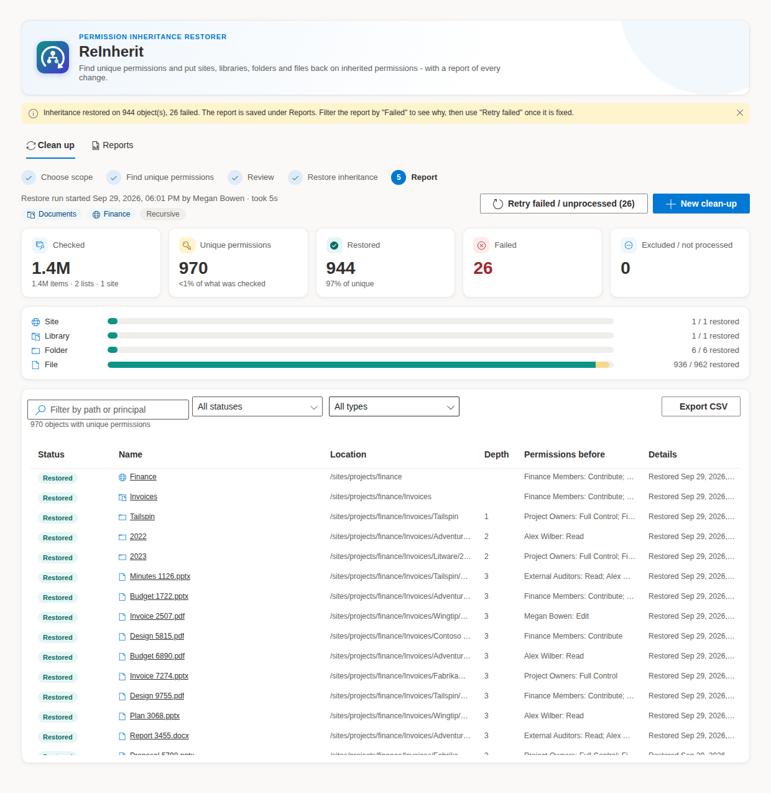
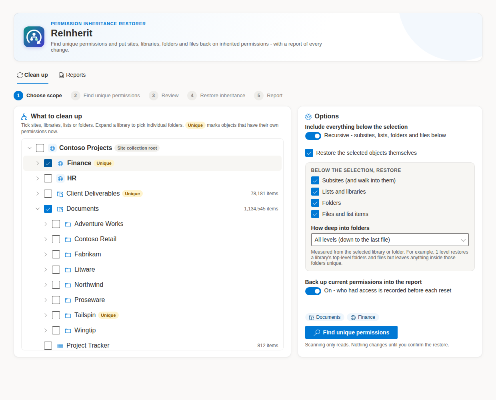
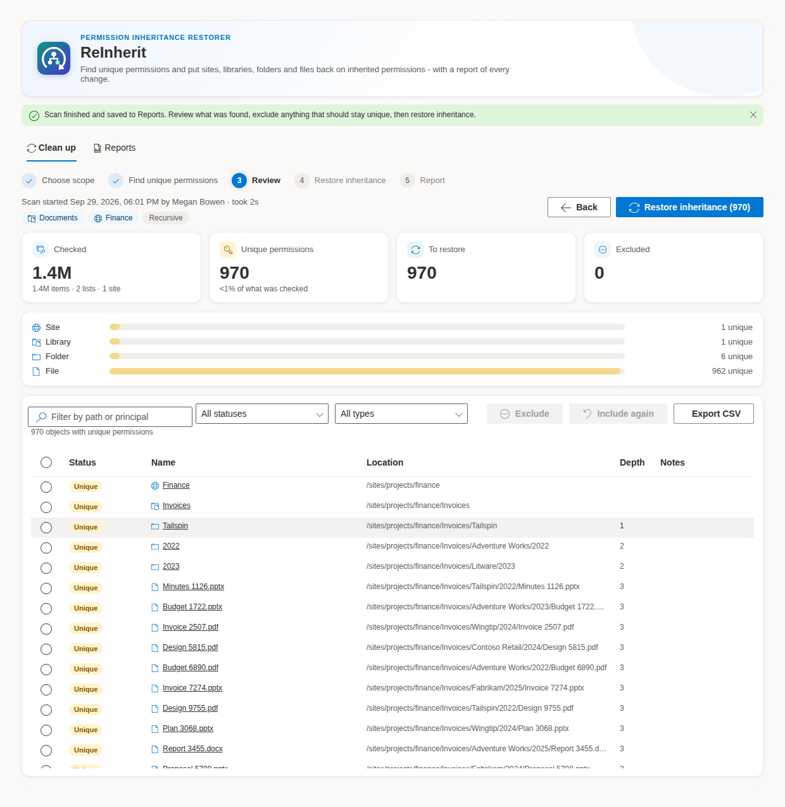

# ReInherit


**Find unique permissions and put SharePoint back on inherited permissions,
in bulk, with a report of every change.** Pick sites, libraries, lists or
folders, choose how deep to go, review what was found, and restore
inheritance on all of it at once. It works on libraries with millions of
files. No Azure app registration, no PowerShell, one `.sppkg`.


<sub>Sample data from a fictional site collection.</sub>

Years of "Share" clicks, one-off folder permissions and migrated ACLs leave
a site with thousands of objects that no longer follow the site's
permissions. SharePoint's own UI resets inheritance one item at a time, and
the usual script (`Get-PnPListItem` then `ResetRoleInheritance` per item)
needs an app registration or admin session and takes hours on a large
library. ReInherit runs in the page as a site owner and does the same job
in bulk.

## Highlights

- **Choose the scope.** A tree of the site collection: subsites, lists,
  libraries and folders, loaded as you expand it. Objects that have unique
  permissions now are tagged **Unique**. Select as many as you need.
- **Recursive or not.** Restore just the selected objects, or everything
  below them. Choose which kinds of object to restore below the selection
  (subsites, lists and libraries, folders, files and list items) and how
  deep into folders to go: all the way down to the last file, or only the
  top 1, 2, 3 … folder levels.
- **Review before anything changes.** The scan only reads. You see every
  object with unique permissions, can filter and exclude any that should
  stay unique, and confirm before the restore starts.
- **Built for millions of items.** Items are read 5,000 IDs at a time in
  four parallel ID ranges, which stays under the list view threshold in a
  library of any size. Resets go 100 per REST `$batch` request. Throttling
  (`429` / `503`) is waited out, honouring `Retry-After`.
- **A report you can hand to someone.** Headline figures, a breakdown by
  type, and a searchable table of every site, list, folder and file that
  had unique permissions and what happened to it. Optionally records **who
  had access before** each reset. Every run is saved to the site under
  **Reports**, and exports to CSV for Excel.
- **Safe to re-run.** A restore that is stopped or fails part-way can be
  resumed with **Retry failed / unprocessed**. Running a new scan over the
  same scope only finds what is still unique.
- **Nothing outside SharePoint.** Runs as the signed-in user through SPFx's
  `SPHttpClient`. No Entra ID app, client secret, Graph permissions or
  tenant admin consent.

## How it works



1. **Choose scope.** Tick sites, libraries, lists or folders in the tree
   and set the options.
2. **Find unique permissions.** ReInherit walks the scope and lists every
   object whose `HasUniqueRoleAssignments` is true. The scan is saved as a
   report straight away, so it also works as a permissions audit.
3. **Review.** Filter by type, status or path, and **Exclude** anything
   that should keep its own permissions.
4. **Restore inheritance.** After you confirm, each remaining object's
   current permissions are backed up into the report (if backup is on),
   then `ResetRoleInheritance` is called on it.
5. **Report.** See what was restored and what failed and why, retry the
   failures, or export the CSV.



### Options

| Option | What it does |
| ------ | ------------ |
| **Include everything below the selection** | Off: only the selected sites, lists and folders are checked. On: everything underneath them is checked as well. |
| **Restore the selected objects themselves** | Also reset the ticked site, list or folder, not just what is below it. Off is useful when a library should keep its own permissions but everything inside should follow the library. |
| **Subsites (and walk into them)** | Go into subsites of a selected site, and restore subsites that have unique permissions. |
| **Lists and libraries** | Restore lists and libraries (below a selected site) that have unique permissions. |
| **Folders** / **Files and list items** | Restore folders, and files or list items, that have unique permissions. Untick **Files** to fix the folder structure but leave individually shared files alone. |
| **How deep into folders** | All levels (down to the last file), or 1, 2, 3, 4, 5 or 10 levels below the selected library or folder. A top-level file or folder is level 1. |
| **Back up current permissions into the report** | Before each reset, read the object's role assignments and store them in the report as *"Finance Members: Contribute; Jane Doe: Read"*. `Limited Access` is left out because SharePoint manages it itself. If an object's permissions can't be read, that object is not reset. |

### What restoring inheritance does

Resetting inheritance **deletes the object's own role assignments** and
makes it use its parent's permissions again. Anyone who had access only
through the object's unique permissions, including people given access
through a **sharing link**, loses that access. This is what SharePoint's
*Delete unique permissions* button does, applied in bulk. It can't be
undone automatically; with backup on, the report records exactly who had
which access so it can be put back by hand if needed.

A few things are never touched:

- The **root site** of a site collection. It has no parent to inherit
  from.
- Hidden lists, catalogs (master pages, web part gallery, etc.) and
  SharePoint's own system lists.
- App webs (add-in sites).

## Why it scales

A library with a million files and a few thousand unique permissions is
the case ReInherit is built for.

1. **Structure is cheap to read.** Sites, lists and folders in the picker
   come from `_api/web/webs`, `_api/web/lists` and `Folder/Folders`, one
   level at a time. None of these enumerate files.
2. **Items are read in ID ranges, in parallel.**
   `items?$select=Id,FileRef,FSObjType,HasUniqueRoleAssignments&$filter=Id ge 1 and Id le 5000`,
   then 5,001–10,000, and so on up to the list's highest ID, with four
   ranges in flight at once. `Id` is always indexed, so every request
   stays under the 5,000-item list view threshold no matter how big the
   library is. A million items is about 200 requests. A range that times
   out is split in half and retried, down to 250 IDs; a range that still
   fails is recorded in the report and the scan carries on.
3. **Only what matters is kept.** Rows without unique permissions are
   counted and dropped, so memory grows with what is found, not with the
   size of the library.
4. **Folders share a pass.** Several folders selected in the same library
   are covered by one pass over that library, and a folder inside a
   library that has already been scanned in full is not read again.
5. **Resets are batched.** Objects are grouped by site and sent as
   `ResetRoleInheritance` calls, 100 per `_api/$batch` request, two batches
   at a time. Each call is in its own change set, so one failure affects
   one object only. The permission backup is batched the same way. If a
   tenant rejects `$batch`, ReInherit falls back to one call at a time.
6. **Throttling doesn't become failure.** `429` and `503` responses, for
   the whole batch or for single requests inside it, are retried after
   `Retry-After` (or an increasing back-off). Dropped connections are
   retried too.

**Rough timings.** Scanning costs about one request per 5,000 item IDs.
Restoring costs about one request per 100 objects, or two with backup on.
Actual speed depends on your tenant's throttling.

**Keep the page open.** The work runs in your browser tab. Closing or
reloading the tab stops it (the browser asks first). If that happens, run
the scan again: the objects that were already restored no longer have
unique permissions, so only the rest are found.

## Reports

Every scan, and the restore that follows it, is saved as a report in the
**root site** of the site collection:

- `SiteAssets/ReInherit/reinherit-report-<id>.json`: one file per run.
- `SiteAssets/ReInherit/reinherit-index.json`: a short list of recent runs
  (the last 200), used by the **Reports** tab.

The **Reports** tab lists past runs: when, who ran them, the scope, and how
many objects were found, restored and failed. Open any run to see its full
report and export it to CSV.

The CSV has one row per object: status, type, name, path, site, list, item
ID, folder depth, permissions before restore, restored-at time and any
error message. Parts of the scope that could not be read are listed at the
end.

**Who can see the reports.** The `ReInherit` folder inherits the Site
Assets library's permissions, which usually means site members can read
it. A report can name files that had unique permissions and, with backup
on, who had access to them. If that is too broad for your site, give the
`ReInherit` folder its own permissions.

## Who can use it

- **Restoring inheritance** needs *Manage Permissions* on the site (site
  owners and site collection administrators have it). Everyone else sees
  only the **Reports** tab.
- Everything runs as the signed-in user. Subsites, lists and items the
  user can't manage return an error, which is recorded against that object
  or in the report's scan errors, and the rest of the run continues. Run it
  as a site collection administrator to cover everything.
- Saving reports needs write access to the root site's Site Assets. If the
  save fails, the report stays on screen and a warning says to export it.

## Get started

1. Download [`releases/reinherit-webpart.sppkg`](releases/reinherit-webpart.sppkg).
2. Upload it to your tenant or site collection **App Catalog** and click
   **Deploy**. The solution uses `skipFeatureDeployment`, so it can be made
   available to all sites without activating a feature on each one.
3. Add the **ReInherit** web part to a page on the site you want to clean
   up. A page only site owners can reach is a good home for it.
4. Pick what to clean up and click **Find unique permissions**.

No app registration, API permission request or admin consent is needed.

## Project layout

```
assets/
  reinherit-logo.svg                Logo (also embedded as the toolbox icon)
  reinherit-logo-256.png
sharepoint/images/
  ReInheritAppIcon.png              App Catalog icon
src/webparts/reInherit/
  ReInheritWebPart.ts               Web part entry point, property pane
  ReInheritWebPart.manifest.json
  components/
    ReInherit.tsx                   Main flow: scope -> scan -> review -> restore -> report
    ScopePicker.tsx                 Lazy tree of sites, lists, libraries and folders
    OptionsPanel.tsx                Recursive, object types, folder depth, backup
    ReportView.tsx                  Figures, breakdown by type, filterable table, CSV
    ReportHistory.tsx               Saved runs
    Logo.tsx                        Inline logo
    format.ts                       Number, date and duration formatting
    ReInherit.module.scss
  services/
    SpRest.ts                       SPHttpClient wrapper: throttling, retries, $batch, cancel
    batch.ts                        $batch request builder and response parser
    ScopeService.ts                 Loads the picker tree
    UniquePermissionScanner.ts      Finds unique permissions (parallel ID ranges)
    InheritanceRestorer.ts          Backs up and resets inheritance, 100 per batch
    ReportStore.ts                  Saves and loads reports in Site Assets
    ExportService.ts                CSV export
    pool.ts                         Small concurrency pool
    httpErrors.ts                   Reads SharePoint's error message from a response
  models/                           Shared TypeScript interfaces
  loc/                              Localized strings
```

## Build

Requires Node.js 18 (SPFx 1.18 does not support Node 19 or later).

```bash
npm install
gulp bundle --ship
gulp package-solution --ship
```

This writes `sharepoint/solution/reinherit-webpart.sppkg`. The prebuilt
package is committed at `releases/reinherit-webpart.sppkg`.

To try it against a real site, run `gulp serve` and open
`https://<tenant>.sharepoint.com/sites/<site>/_layouts/15/workbench.aspx`.

When you upgrade, upload the new package with the **same file name** and
choose **Replace** in the App Catalog.
