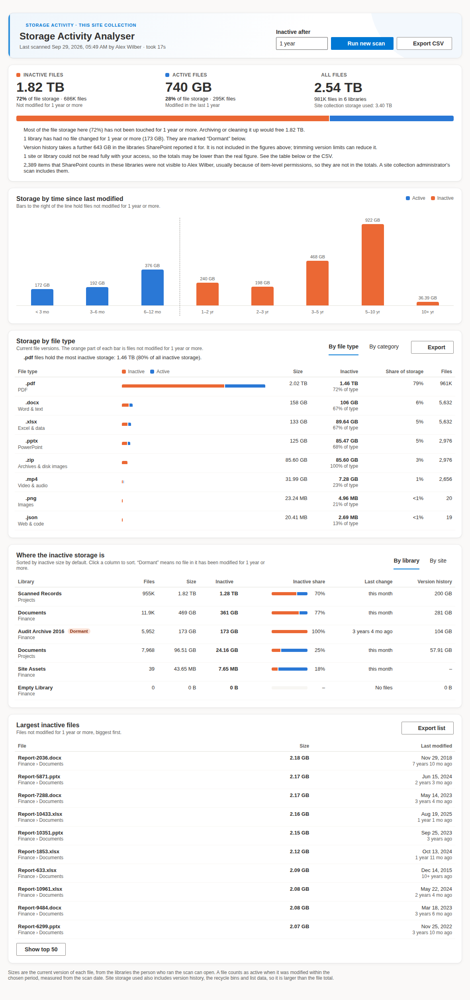

# Storage Activity Analyser

**How much of a SharePoint site's storage is in files people still use?**
One `.sppkg`, no Azure app registration, no extra permissions. The web
part runs as the person viewing the page.


<sub>Sample data from a simulated site collection.</sub>

SharePoint Online shows how much storage a site uses. It does not show how
much of that storage is in files nobody has touched for years. Storage
Activity Analyser adds up the size of every file by when it was last
modified. It then splits the total into **active** files (modified within
the period you choose) and **inactive** files (not modified for that long
or longer). For example: *558 GB inactive, not modified for 1 year or more;
181 GB active.* With that split, owners can decide what to archive, move or
delete.

## What it shows

- **Active vs inactive split.** Total size, share of storage and file count
  for each side, with a split bar. Next to it: all files and the site
  collection storage figure that SharePoint reports.
- **Inactive after: 3 months, 6 months, 1, 2, 3 or 5 years.** Pick the
  period on the dashboard. The figures update at once without a new scan,
  because the scan keeps month-by-month detail. The default comes from the
  web part settings.
- **Storage by time since last modified.** Bars for &lt; 3 months up to
  10+ years. Bars past the chosen period are coloured as inactive. Hover
  or focus a bar to see its size, share and file count.
- **Where the inactive storage is.** A table by library or by site, sorted
  by inactive size. It shows files, size, inactive size, inactive share,
  when anything in it last changed and, where SharePoint reports it, the
  size of version history. A library where nothing has changed within the
  period is marked **Dormant**. Those libraries are usually the easiest to
  archive whole.
- **Largest inactive files.** The biggest files older than the chosen
  period, with links, and a CSV export.
- **Plain-language insights.** For example, how much space cleaning up
  would free, how many libraries are dormant, how much version history
  adds, and whether any site or library could not be read.
- **CSV export.** One row per library, with the split for the chosen
  period and the size in each age band.
- **Saved for everyone.** When a site owner runs a scan, the result is
  saved in the site's Site Assets. Anyone who opens the page sees it
  straight away.

## Permissions: none beyond what the user already has

Every call goes through SPFx's built-in `SPHttpClient`, which uses the
signed-in user's existing SharePoint session. There is:

- no Azure AD / Entra ID app registration, client ID or secret,
- no Microsoft Graph and no API permission request in the package, so
  there is nothing for a tenant admin to approve in *API access*, and
- no elevated or app-only access.

The web part only calls `_api/*` endpoints on the site it is added to. It
reads only what the current user can already open:

| Who opens the page                  | What they can do                                                          |
| ----------------------------------- | ------------------------------------------------------------------------- |
| Visitor / member                    | See the last saved scan. Run their own scan (shown only to them).         |
| Site owner / site collection admin  | Run a scan that is saved for everyone who opens the page.                 |

Results are security-trimmed. A library or subsite the user cannot open is
not counted, and the dashboard says so. For the complete picture, run the
scan as a site collection administrator.

## How it works

1. **Find the sites and libraries.** The scan starts at the site collection
   root (or, if set, at the current site). It walks subsites with
   `_api/web/getsubwebsfilteredforcurrentuser(...)`, which only returns
   subsites the user can open. It lists every visible document library with
   `_api/web/lists?$filter=BaseType eq 1 and Hidden eq false`. That includes
   Documents, Site Assets, Site Pages and custom libraries, because they all
   use storage.
2. **Read each file's size and last-modified date.** For each library it
   pages through
   `_api/web/lists(guid'…')/items?$select=Id,FSObjType,Modified,FileRef,File/Length&$expand=File&$top=5000`,
   5,000 items per request, and follows SharePoint's own next-page link.
   Paging by ID works on libraries of any size, with no list view threshold
   error. Folders are skipped. Only numbers are kept: a count and byte total
   per month of age, plus the 200 largest files older than 3 months. Memory
   use in the browser therefore stays flat however many files there are.
3. **Version history, where available.** For each library it reads
   `RootFolder/StorageMetrics`, SharePoint's own storage figure. `TotalSize`
   minus `TotalFileStreamSize` is the space used by version history. If the
   user cannot read it, that column shows "–" and nothing else changes.
4. **Site storage.** `_api/site?$select=Usage` supplies the site collection
   storage figure for context.

## Very large libraries (a million files and more)

The scan is built for libraries far beyond the 5,000-item list view
threshold:

- **Parallel ID ranges.** A library with more than 20,000 items is split
  into ranges of 50,000 IDs (`$filter=Id gt … and Id le …`). Three readers
  work through the ranges at once. ID is the list's primary key, so
  filtering on it is allowed at any size. The last range is open-ended, so
  files added during the scan are still read.
- **Lean responses.** Requests ask for `odata.metadata=nometadata`, which
  drops the per-item OData metadata that SharePoint adds by default.
- **Patient with throttling.** Long scans are expected to be throttled.
  Each throttled request (`429`/`503`) waits for `Retry-After`, or backs off
  up to 5 minutes, and tries again up to 12 times before giving up.
- **Timeouts.** If a page times out, the scan requests it again with a
  smaller page size (down to 500).
- **Failures stay local.** If one ID range fails, the others carry on. The
  library is marked *only partly read* and keeps everything that was read.
  If a subsite or library fails, it is marked in the table and in the CSV,
  and the scan continues.
- **Nothing missed silently.** If SharePoint returns a full page without a
  next-page link, the scan continues from the last ID itself. After each
  library, the number of items read is compared with the library's
  `ItemCount`. A shortfall, usually items the scanning user cannot see
  because of item-level permissions, is reported on the dashboard, in the
  table and in the CSV.

**How long it takes.** Scan time grows with the number of files: about one
request per 5,000 files, so a million files is about 200 requests, spread
over three parallel readers. How fast each request returns depends on the
tenant's load and how much throttling SharePoint applies, so expect
anything from several minutes to around half an hour for a million-file
library. Progress shows the files and bytes read so far, and **Cancel**
stops the scan. Keep the page open until the scan finishes. The results are
saved only at the end.

## What the numbers mean

- **Active / inactive is based on the file's *Modified* date.** A file is
  inactive when it has not been modified for the chosen period, counted in
  calendar months from the start of the scan. Editing a file's properties
  also updates *Modified*. SharePoint's REST API does not give a per-file
  "last opened" date to ordinary users, so files that people only read
  count as inactive.
- **Sizes are the current version of each file.** Version history is shown
  separately (see above) and is not in the active/inactive totals. The
  split is about the files themselves.
- **The file total is smaller than *Site collection storage used*.** Site
  storage also includes version history, the first- and second-stage
  recycle bins, list items and attachments.
- **Only what the scanning user can see is counted.**

## Settings (web part property pane)

| Setting                        | Options                                             | Default                  |
| ------------------------------ | --------------------------------------------------- | ------------------------ |
| Web part title                 | Text                                                | Storage Activity Analyser |
| What to scan                   | Whole site collection, or this site and its subsites | Whole site collection    |
| Default inactivity period      | 3 / 6 months, 1 / 2 / 3 / 5 years                   | 1 year                   |

## Saved results

After an owner's scan, the result is written to the Site Assets library of
the site hosting the page, as `storage-activity-analyser-site-collection.json`
or `storage-activity-analyser-site.json` depending on scope. It holds
library and site names, counts and sizes, plus the names and paths of up to
200 of the largest inactive files that the owner could see. It holds no
file contents. Anyone who can read Site Assets can read it. If saving
fails, the owner still sees the results and a warning explains why.

## Get started

1. Download [`releases/storage-activity-analyser-webpart.sppkg`](releases/storage-activity-analyser-webpart.sppkg).
2. Upload it to the tenant App Catalog, or a site collection App Catalog,
   and click **Deploy**. The package has `skipFeatureDeployment: true`, so
   you can make it available to all sites or add it site by site. It
   requests no API permissions, so nothing needs approval.
3. Edit a page on the site you want to analyse and add **Storage Activity
   Analyser**. It is in the *Other* group.
4. Click **Start scan**.

To upgrade, upload a file with the same name and choose **Replace**.

## Build from source

Prerequisites: Node.js 18 (SPFx 1.18.2 supports Node 16.13–18.x).

```bash
npm install
gulp bundle --ship
gulp package-solution --ship
```

This produces `sharepoint/solution/storage-activity-analyser-webpart.sppkg`.
To test against a real site, run `gulp serve` and open
`https://<tenant>.sharepoint.com/sites/<site>/_layouts/15/workbench.aspx`.

## Project layout

```
src/webparts/storageActivityAnalyser/
  StorageActivityAnalyserWebPart.ts      Web part entry point and property pane
  StorageActivityAnalyserWebPart.manifest.json
  components/
    StorageActivityAnalyser.tsx          Header, threshold picker, scan / cancel / export, load and save
    dashboard/
      Dashboard.tsx                      Lays out the panels below
      SplitSummary.tsx                   Active vs inactive figures, split bar, insights
      AgeChart.tsx                       Storage by time since last modified
      LocationTable.tsx                  By library / by site table, sortable
      LargestFiles.tsx                   Largest inactive files
      format.ts, motion.ts               Formatting and count-up / entrance helpers
  services/
    StorageScanService.ts                All SharePoint REST calls and the scan itself
    activity.ts                          Age buckets, thresholds and the active / inactive split
    ResultsStore.ts                      Save / load the last scan in Site Assets
    ExportService.ts                     CSV exports
    httpErrors.ts, formatBytes.ts        Helpers
  models/IScanResult.ts                  Scan result and progress types
  loc/                                   Strings
```
