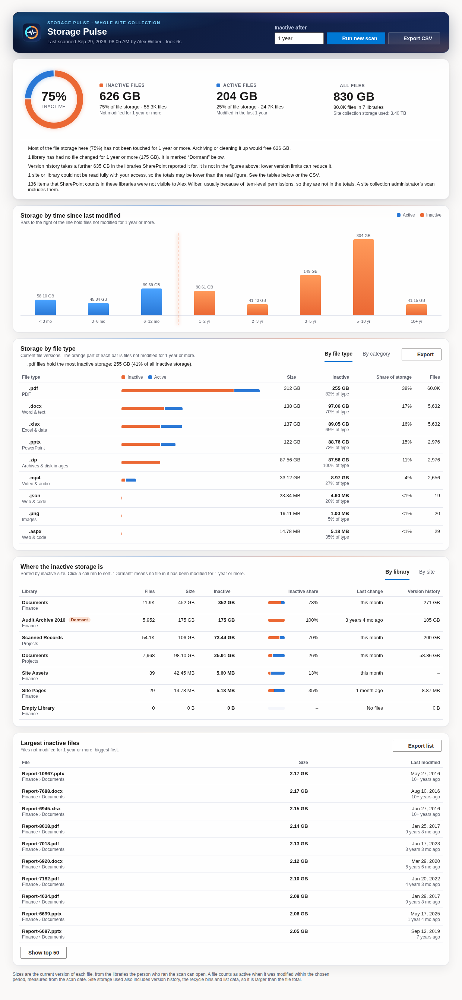

<p align="center">
  
</p>

**How much of a SharePoint site's storage is in files people still use?**
Storage Pulse is one `.sppkg`. It needs no Azure app registration and no
API permissions, and runs as the person viewing the page.


<sub>Sample data from a simulated site collection.</sub>

SharePoint Online shows how much storage a site uses. It doesn't show how
much of that storage is in files nobody has touched for years. Storage
Pulse adds up the size of every file by when it was last modified and
splits the total into:

- **active** files, modified within the period you choose;
- **inactive** files, not modified for that long or longer.

For example: *626 GB inactive, not modified for 1 year or more; 204 GB
active.* Owners can then decide what to archive, move or delete.

## What it shows

- **The split.** A ring gauge with the inactive share, plus size, share
  and file count for active files, inactive files and all files. The site
  collection storage figure SharePoint reports is shown alongside.
- **Insights in plain language.** How much space a clean-up would free,
  which libraries are dormant, how much version history adds, and anything
  that couldn't be read.
- **Inactive after: 3 or 6 months, or 1, 2, 3 or 5 years.** Changing it
  updates every figure instantly, with no new scan. The default comes from
  the web part settings.
- **Storage by time since last modified.** Bars from under 3 months to 10+
  years, split into active and inactive at a glowing threshold line.
- **Storage by file type** (`.pdf`, `.mp4`, `.zip` …) or **by category**
  (Video & audio, Images, Archives, PDF, Office documents, Design & CAD,
  Email, Databases & backups …). Each bar is split into inactive and active.
- **Where the inactive storage is.** A table by library or by site. It
  marks **Dormant** libraries (nothing changed within the period) and shows
  version history size where SharePoint reports it.
- **Largest inactive files**, with links.
- **CSV exports.** One export each for libraries, file types (per library)
  and the largest inactive files.
- **Saved for everyone.** A site owner's scan is saved in Site Assets.
  Anyone who opens the page sees it straight away, with a warning once it
  is older than a set number of days.

It follows the site's theme colour, works on dark section backgrounds and
in Microsoft Teams (light, dark and high contrast), and respects "reduce
motion".

## Permissions and security

Every call goes through SPFx's built-in `SPHttpClient` with the signed-in
user's existing SharePoint session.

- There's no Azure AD / Entra ID app registration, client ID or secret.
- The package requests **no API permissions**, so there's nothing for an
  admin to approve under *API access*.
- There's no elevated or app-only access, and no data leaves SharePoint.
- It only calls `_api/*` endpoints on the site collection it's added to.

| Who opens the page | What they can do |
| --- | --- |
| Site owner / site collection admin | Run a scan. The result is saved for everyone. |
| Member / visitor | See the last saved scan. They can run their own scan only if an owner allows it in the settings, and that scan is shown only to them. |

Results are security-trimmed: the scan only counts what the person running
it can open. Items hidden by item-level permissions are counted and
reported, but not included in the totals. Run the scan as a site
collection admin for the complete picture.

**Hardening in v2.**
- **The saved results file is treated as untrusted when read.** It sits in
  Site Assets, which members can usually edit. Every value is checked and
  sizes are capped.
- **Only safe links become links.** Only `https` URLs on the tenant's own
  SharePoint host are rendered as links. Anything else, such as
  `javascript:` or another domain, is shown as plain text.
- **"Last scanned by" comes from SharePoint.** It uses SharePoint's own
  record of who last modified the file, not the file's contents.
- **A broken or edited file can't take the page down.** It produces a
  warning, and a rendering error shows a message instead of breaking the
  page.

### What is stored, and where

After an owner's scan, one JSON file is written to the **Site Assets**
library of the site that hosts the page:
`storage-pulse-site-collection.json`, or `storage-pulse-site.json` for the
"this site and its subsites" scope. The file contains:

- site and library names and URLs;
- file counts and sizes per month of age and per file type;
- the names and paths of up to 200 of the largest files older than 3
  months;
- who ran the scan, when, and the scan settings.

It contains no file contents. Anyone who can read Site Assets can read it.
Nothing is stored anywhere else, and nothing is sent outside SharePoint.

## Settings (web part property pane)

| Group | Setting | Default |
| --- | --- | --- |
| General | Web part title | Storage Pulse |
| | Default inactivity period | 1 year |
| | Warn when results are older than (days, 0 = never) | 90 |
| What to scan | Scan: whole site collection, or this site and its subsites | Whole site collection |
| | Include hidden libraries, such as the Preservation Hold Library | Off |
| | Skip Site Pages, Site Assets, Style Library and Form Templates | Off |
| | Libraries to skip (one title or URL name per line) | — |
| Who can scan | Site owners only, or everyone (their scans are shown only to them) | Site owners |

`_catalogs` libraries (master pages, web parts, solutions) are never
scanned.

## How it works

1. **Find the sites and libraries.**
   `_api/web/getsubwebsfilteredforcurrentuser(...)` returns only the
   subsites the user can open. `_api/web/lists?$filter=BaseType eq 1`
   returns the document libraries, filtered by the settings above.
2. **Read each file's size and last-modified date.** It pages through
   `_api/web/lists(guid'…')/items?$select=Id,FSObjType,Modified,FileRef,File/Length&$expand=File&$top=5000`
   with `odata.metadata=nometadata` and follows SharePoint's next-page
   link. Paging by ID works at any library size, with no list view
   threshold error. Only numbers are kept:
   - a count and byte total per month of age;
   - the same per file type and age band;
   - the 200 largest files older than 3 months.

   Browser memory therefore stays flat however many files there are.
3. **Version history.** For each library, `RootFolder/StorageMetrics`
   gives SharePoint's own figure: `TotalSize − TotalFileStreamSize` is the
   version history. If the user can't read it, that column shows "–".
4. **Site storage.** `_api/site?$select=Usage` gives the site collection
   total for context.

### Very large libraries (a million files and more)

- **Parallel ID ranges.** A library with more than 20,000 items is split
  into 50,000-ID ranges (`$filter=Id gt … and Id le …`), and three readers
  work through them at once. The last range is open-ended, so files added
  during the scan are still read.
- **Patient with throttling.** A `429`/`503` response waits for
  `Retry-After`, or backs off up to 5 minutes, and tries again up to 12
  times. Network failures are retried separately.
- **Cancel is immediate**, even during a throttling wait.
- **Timeouts.** A page that times out is requested again with a smaller
  page size, down to 500.
- **Failures stay local.** If one range, library or subsite fails, it's
  marked and the rest of the scan carries on.
- **Nothing missed silently.**
  - If SharePoint returns a full page without a next-page link, the scan
    continues from the last ID itself.
  - After each library, the number of items read is compared with its
    `ItemCount`, and any shortfall is reported.

**How long it takes.** It's about one request per 5,000 files. A
million-file library is about 200 requests over three parallel readers.
Expect anywhere from several minutes to around half an hour, depending on
tenant load and throttling. The scan panel shows items read, data read,
speed and time left. Keep the page open until the scan finishes.

## What the numbers mean

- **Active or inactive is based on each file's *Modified* date,** counted
  in calendar months from the start of the scan. Editing a file's
  properties also updates *Modified*. SharePoint's REST API doesn't give
  ordinary users a per-file "last opened" date, so files that people only
  read count as inactive.
- **Sizes are the current version of each file.** Version history is
  reported separately.
- **Site storage used is larger than the file total.** It also includes
  version history, the recycle bins and list data.

## Get started

1. Download [`releases/storage-pulse.sppkg`](releases/storage-pulse.sppkg).
2. Upload it to the tenant App Catalog, or a site collection App Catalog,
   and click **Deploy**. The package has `skipFeatureDeployment: true`, so
   you can make it available to all sites or add it site by site.
3. Edit a page and add **Storage Pulse**, from the *Other* group.
4. Click **Start scan**.

For Microsoft Teams, select the app in the App Catalog and choose **Sync
to Teams**, then add it as a tab.

### Upgrading from Storage Activity Analyser (v1.x)

Storage Pulse is the same solution under a new name. The solution ID and
web part ID are unchanged, so pages that already host the web part keep
working, and their saved scans still load.

1. The package file name changed, and the App Catalog matches entries by
   file name. So **delete the old `storage-activity-analyser-webpart.sppkg`
   entry first**, then upload `storage-pulse.sppkg` and deploy it straight
   away.
2. New in v2: **only site owners can scan by default**. v1 let anyone scan
   for themselves. To keep that behaviour, set **Who can run a scan** to
   *Everyone*.

## Build from source

The SPFx build needs Node.js 18 (SPFx 1.18.2 supports 16.13–18.x).

```bash
npm install
npx gulp bundle --ship
npx gulp package-solution --ship    # -> sharepoint/solution/storage-pulse.sppkg
```

To try it on a real site, run `npx gulp serve` and open
`https://<tenant>.sharepoint.com/sites/<site>/_layouts/15/workbench.aspx`.

## Tests

The tests live in `tests/` and need Node.js 20+. They use a simulated
SharePoint REST API: webs, a 403 subsite, hidden and catalog libraries, a
large lazily generated library with deleted-ID gaps, item-level
permissions, missing next links, throttling and timeouts.

```bash
cd tests
npm ci
npm test          # unit + scan-engine tests (Node)
npm run e2e       # browser tests of the built web part; run `gulp bundle` first
```

- **Unit tests** cover:
  - age and threshold maths;
  - file-type splits matching the overall totals;
  - link and saved-file sanitising, including `javascript:` and
    other-domain URLs;
  - exact totals from a 130,000-item parallel scan;
  - hidden-item reporting, library exclusion and smaller-page retries;
  - Cancel during a 2-minute throttle wait.
- **Browser tests** cover:
  - the owner scan and save, and "saved by" taken from SharePoint;
  - a tampered results file (no script links rendered) and a corrupt one
    (a warning, no crash);
  - visitor permissions, the stale-results banner and Cancel;
  - dark mode, and phone width with no horizontal scrolling.

GitHub Actions (`.github/workflows/storage-pulse.yml`) builds, tests and
packages on every push, and publishes the `.sppkg` as an artifact.

## Project layout

```
src/webparts/storagePulse/
  StoragePulseWebPart.ts               Web part: settings, theme / section / Teams awareness
  StoragePulseWebPart.manifest.json
  assets/                              Toolbox icon
  components/
    StoragePulse.tsx                   Header, scan / cancel / export, load and save, banners
    ScanPanel.tsx                      Live scan view: radar, steps, speed, time left
    PulseMark.tsx                      The logo as animated inline SVG
    ErrorBoundary.tsx                  Keeps a rendering error from breaking the page
    text.ts                            Localized text helpers
    dashboard/                         Summary + gauge, age chart, file types, tables
  services/
    StorageScanService.ts              All SharePoint REST calls and the scan
    activity.ts                        Age buckets, thresholds, active / inactive maths
    safeData.ts                        Link safety and saved-file sanitising
    ResultsStore.ts                    Save / load the last scan in Site Assets
    ExportService.ts                   CSV exports
  models/IScanResult.ts
  loc/                                 All on-screen text (add a <locale>.js to translate)
sharepoint/assets/                     App Catalog icon and screenshot
assets/logo/                           Logo (SVG master, PNGs, lockup) and concepts
tests/                                 Simulated SharePoint, unit / scan / browser tests
```
