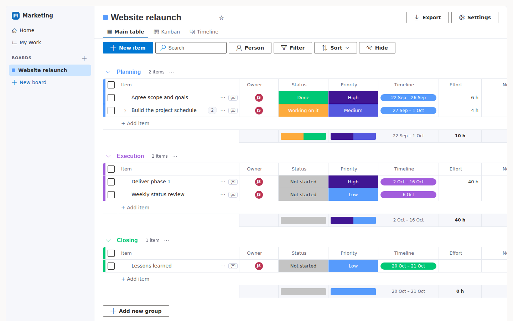
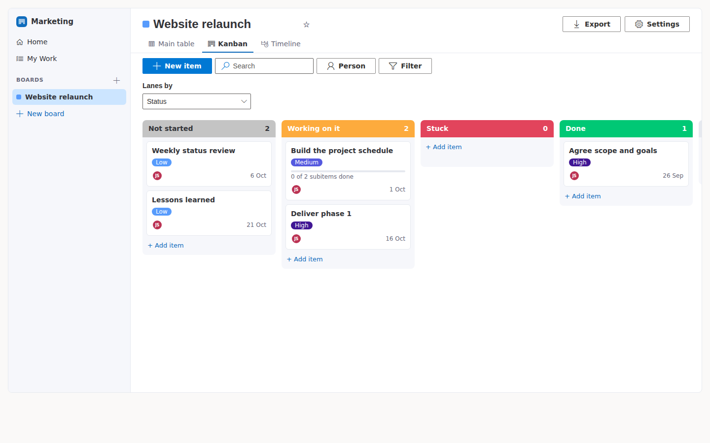
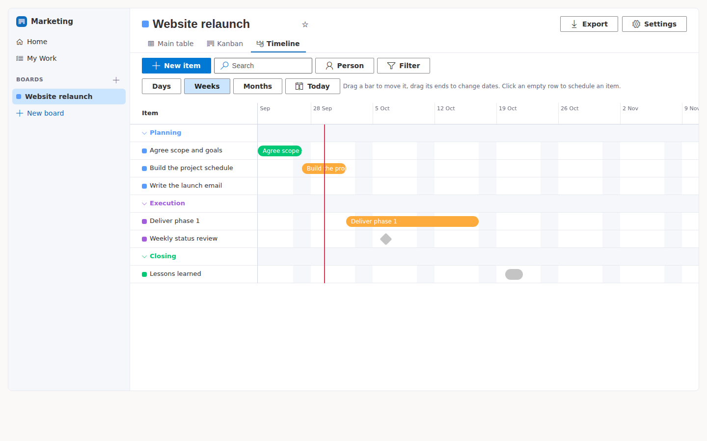
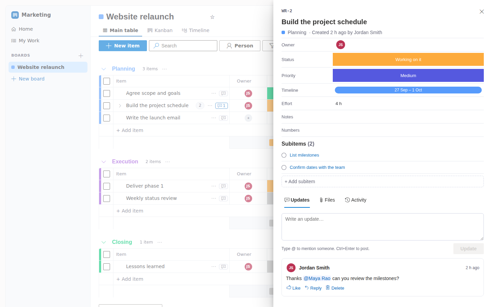

# Work Boards

**Team and project work in SharePoint: boards, Kanban and timelines, in lists your
organisation already owns.** No Azure app registration, no client id, no Microsoft
Graph permissions, no per-seat licence. One `.sppkg` and a site owner.


<sub>Sample data on a fictional site.</sub>

Work Boards covers the monday.com features a department uses for day-to-day work
and project management: boards made of groups and items, coloured status labels,
owners, timelines, a Kanban view, a Gantt-style timeline, updates with @mentions,
files and a full change history. Everything is stored in hidden SharePoint lists on
the site where you add it, so SharePoint permissions, search, retention and backup
all apply as they do to any other list.

> **Status: Phase 1 (core).** See [the plan](docs/PLAN.md) for what comes next and
> [the wireframes](docs/wireframes.html) for the design.

## What you can do

- **Boards, groups, items and subitems.** Start from a template (Project plan, Team
  tasks, Team requests or Blank), rename and colour groups, drag items to reorder
  them or move them between groups, and break items into subitems.
- **Columns.** Status (coloured labels you define), People, Timeline, Date, Text,
  Long text, Numbers (summed per group), Dropdown, Checkbox and Link. Add, rename,
  reorder or delete columns and edit labels. Renaming a label updates the items
  that use it.
- **Main table.** Edit cells in place, collapse groups, select several items to
  move or delete them, and see a summary row per group (status mix, date span,
  totals).
- **Kanban.** Lanes come from any Status column. Drag a card to change its status.
- **Timeline.** A Gantt-style view by day, week or month. Drag a bar to move it,
  drag its ends to change dates, or click an empty row to schedule an item.
- **Item panel.** All of an item's fields, its subitems, **updates** with
  @mentions, replies and likes, **files** (drag and drop) and an **activity log**
  of who changed what, from what, to what.
- **Search, filter and sort.** Search text, filter by person, by any Status or
  Dropdown label, or by date (overdue, next 7 days, no date), sort by any column
  and hide columns. Your view is remembered per board.
- **My Work and Home.** Everything assigned to you across every board you can
  open, grouped into Overdue, Today, Next 7 days, Later and No date, plus recent
  boards and favourites.
- **Private boards.** Site owners can make a board visible only to chosen members,
  viewers and owners.
- **Export.** Download any board as CSV for Excel.
- **Near-live.** Changes other people make appear within about 20 seconds. If two
  people edit the same item at once, both changes are kept.

| Kanban | Timeline | Item panel |
| --- | --- | --- |
|  |  |  |

## Get started

Work Boards is deployed to **the sites you choose**. It does not appear on every site.

1. **Upload the package.** Download
   [`releases/work-boards-webpart.sppkg`](releases/work-boards-webpart.sppkg) and upload it to your
   tenant App Catalog (or a site collection App Catalog). When SharePoint asks,
   choose **Deploy**. There are no API permissions to approve.
2. **Add the app to a site.** On each site that should use Work Boards, a site owner
   goes to **Settings (gear) > Add an app** and adds **Work Boards**.
3. **Create a page.** Create a page (for example *Work Boards*), use a
   **one-column full-width section**, add the **Work Boards** web part and publish.
   Add the page to the site navigation.
4. **Set up.** The first time a site owner opens the page, Work Boards shows a
   setup screen. Click **Set up**. It creates three hidden lists (`WB_Meta`,
   `WB_Boards`, `WB_UserPrefs`) in under a minute. Anyone else who opens the page
   first is asked to contact a site owner.
5. **Create a board.** Click **New board**, pick a template and a name.

## How it works

- **Runs as the signed-in user.** The web part calls only the site's own
  `/_api` through SPFx's built-in `SPHttpClient`. It never requests a token for
  another service, so there is nothing to register in Entra ID and nothing to
  approve in the API access page. SharePoint enforces every permission on the
  server.
- **One list per board.** Creating a board creates two hidden lists:
  `WB_Board_<KEY>` for items and `WB_Board_<KEY>_Updates` for comments. Every
  column is a real SharePoint field, so filtering and sorting run on the server,
  and Excel, Power BI and Power Automate can read the data directly.
- **History for free.** Versioning is on for board lists. The item panel's
  activity log is read from SharePoint's version history.
- **Board settings** (columns, labels, colours, groups) are stored as JSON in the
  board's row in `WB_Boards`, and are saved with optimistic concurrency so two
  owners editing at once don't overwrite each other.
- **Upgrades.** Each release carries numbered, idempotent migrations. When a new
  version needs a schema change, a site owner sees an **Update** button. Nothing
  is changed without them.

### Permissions

| Person | Can |
| --- | --- |
| Site owner | Set up and update Work Boards, create private boards, manage access |
| Site member (Edit) | Create main boards, add and change columns, add and edit items |
| Site visitor (Read) | View boards. Edit controls are hidden |
| Board owner on a private board | Change the board's columns and settings |
| Member of a private board | Add and edit items and post updates |

People you add to a private board also need access to the site itself (at least
Read), because the Work Boards page lives there.

Deleted items, boards and files go to the site recycle bin and can be restored.

### Limits in this version

- **My Work** uses each board's **Owner** column (the People column named Owner in
  every template). Items where you appear only in another People column, such as
  *Requested by*, are not listed there.
- Boards are designed for up to about 20,000 items. Filters on large boards stay
  under SharePoint's 5,000-item threshold because the key fields are indexed.
- There are no email notifications yet. Updates mention people in the app, and
  anyone can also use SharePoint's **Alert me** on a board list.
- Automations, dashboards, forms, calendar view and saved shared views are planned
  for Phase 2 ([plan](docs/PLAN.md)).

## Development

Requirements: Node 22 (see `engines` in `package.json`).

```bash
npm install
npm run build     # lint, compile, unit tests, then package sharepoint/solution/work-boards-webpart.sppkg
npm start         # local workbench against a SharePoint site
```

- `src/app/` – React UI (shell, board page, views, item panel, dialogs)
- `src/services/` – SharePoint access: `SpClient` (retries and throttling),
  `Provisioner` (migrations), `BoardService`, `ItemService`, `UpdateService`,
  `PeopleService`, `PrefsService`
- `src/engine/` – pure logic with unit tests: field mapping, filters and sorting,
  ordering, dates, activity diff, mentions, CSV
- `src/models/` – types, board templates, colours
- `docs/brand/` – the logo (SVG, PNG and wordmark). The App Catalog icon is
  `sharepoint/assets/work-boards-icon.png`; the Teams icons are in `teams/`

Unit tests (`npm run build` runs them) cover the engine, routing, permissions and
the setup migrations against an in-memory fake of the SharePoint API. The UI was
also exercised end to end in a browser against that fake: setup, board creation,
editing cells, labels and columns, Kanban and Timeline drag, updates with
mentions, files, filters, export, delete and private boards.
